# Lab 1 - Cyber Threat Intelligence Report Mapping to MITRE ATT&CK

## 1. Group Members

- `Pavel Fadeev`

> Replace the GitHub username above with the full legal name(s) of the group member(s) before final submission, since the assignment specifically asks for full names.

## 2. Link to the Source CTI Report

- Unit 42, Palo Alto Networks, April 16, 2025:
  [Cascading Shadows: An Attack Chain Approach to Avoid Detection and Complicate Analysis](https://unit42.paloaltonetworks.com/phishing-campaign-with-complex-attack-chain/)

## 3. Short Attack Summary

The Unit 42 report describes a December 2024 phishing campaign that used a layered malware delivery chain to deploy Agent Tesla variants, Remcos RAT, and XLoader. The infection started with a fake "order release" email carrying a compressed archive named `doc00290320092.7z`. Inside the archive was a malicious `doc00290320092.jse` file designed to look like a harmless document, increasing the chance that a victim would open it. Once executed, the JSE downloader fetched and ran a PowerShell script from a remote server. The PowerShell stage decoded a Base64 payload, wrote it to the temporary directory, and launched the next step. From there, the attack split into two branches: a .NET executable path that decrypted a payload and injected it into `RegAsm.exe`, and an AutoIt path that decrypted shellcode, injected into `RegSvcs`, and reflectively loaded another .NET executable. The final payload in the AutoIt branch was an Agent Tesla variant, a well-known infostealer. The campaign is important because it shows how attackers can avoid heavy obfuscation and still complicate detection by chaining together multiple simple stages and legitimate Windows processes.

## 4. Attack Diagram / Sequence

The following sequence is based on Figure 1 and the technical analysis in the Unit 42 report.

```mermaid
flowchart LR
    A[Phishing email posing as order release] --> B[Archive attachment: doc00290320092.7z]
    B --> C[User opens doc00290320092.jse]
    C --> D[JSE downloader retrieves PowerShell script]
    D --> E[PowerShell decodes Base64 payload and executes it]
    E --> F{Next-stage payload}
    F --> G[.NET executable decrypts payload]
    G --> H[Injects into RegAsm.exe]
    H --> I[Loads Agent Tesla variant or XLoader]
    F --> J[AutoIt compiled executable]
    J --> K[Decrypts shellcode and payload]
    K --> L[Injects into RegSvcs]
    L --> M[Reflectively loads .NET executable]
    M --> N[Executes Agent Tesla variant]
```

Short step sequence:

1. The attacker sends a phishing email with a fake business theme.
2. The victim opens a `.7z` archive and runs the embedded `.jse` script.
3. The JSE script downloads and executes a PowerShell stage.
4. PowerShell decodes and launches the next payload from the temp directory.
5. The payload continues through either the .NET branch or the AutoIt branch.
6. The malware injects into legitimate Windows processes and executes the final infostealer payload.

## 5. MITRE ATT&CK Mapping

The table below is an analyst mapping based on the behavior described by Unit 42. Some rows, especially `Masquerading`, are interpretive ATT&CK mappings rather than labels explicitly named in the source article.

| Tactic | Technique | Behavior from the report | ATT&CK entry |
|---|---|---|---|
| Initial Access | Phishing: Spearphishing Attachment | The campaign began with fake "order release" emails that delivered the malicious archive `doc00290320092.7z`. | [T1566.001](https://attack.mitre.org/techniques/T1566/001/) |
| Execution | User Execution: Malicious File | Infection depended on the victim opening the archive and executing `doc00290320092.jse`. | [T1204.002](https://attack.mitre.org/techniques/T1204/002/) |
| Defense Evasion | Masquerading | The archive and embedded script were both named with the `doc` prefix to make the file appear document-like and less suspicious. | [T1036](https://attack.mitre.org/techniques/T1036/) |
| Execution | Command and Scripting Interpreter: JavaScript | The `.jse` file acted as the first-stage downloader and launched the next stage of the attack. | [T1059.007](https://attack.mitre.org/techniques/T1059/007/) |
| Command and Control | Ingress Tool Transfer | The JSE downloader retrieved the PowerShell script from a remote server before executing it. | [T1105](https://attack.mitre.org/techniques/T1105/) |
| Execution | Command and Scripting Interpreter: PowerShell | The PowerShell script decoded a Base64 payload, wrote it to the temp directory, and executed it. | [T1059.001](https://attack.mitre.org/techniques/T1059/001/) |
| Defense Evasion | Deobfuscate/Decode Files or Information | The chain repeatedly decoded or decrypted protected content, including a Base64 payload, encrypted .NET payloads, and encrypted shellcode. | [T1140](https://attack.mitre.org/techniques/T1140/) |
| Execution | Command and Scripting Interpreter: AutoHotKey & AutoIT | One execution path used an AutoIt compiled executable that contained the script logic for loading shellcode and the final payload. | [T1059.010](https://attack.mitre.org/techniques/T1059/010/) |
| Defense Evasion, Privilege Escalation | Process Injection | The .NET branch injected into `RegAsm.exe`, while the AutoIt branch ultimately injected into `RegSvcs`. | [T1055](https://attack.mitre.org/techniques/T1055/) |
| Defense Evasion | Reflective Code Loading | In the AutoIt branch, the injected payload reflectively loaded another .NET executable before launching Agent Tesla. | [T1620](https://attack.mitre.org/techniques/T1620/) |

## 6. Insights / What I Learned

This report shows that attackers do not always need highly advanced malware to be effective; combining several simple stages can already overwhelm basic detection logic. Mapping each stage to MITRE ATT&CK makes the campaign easier to understand from a defender's perspective because it turns a long narrative into concrete techniques that can be monitored and detected. The report also highlights how legitimate Windows processes such as `RegAsm.exe` and `RegSvcs` can be abused to hide malicious execution.
