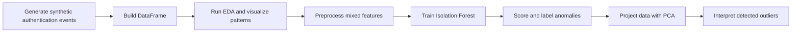

# Lab 2 - Basic Anomaly Detection for Cybersecurity Logs

## 1. Group Members

- `Pavel Fadeev`

> Replace the name above with the full legal name(s) of the group member(s) before final submission if needed.

## 2. Source Dataset / Scenario

- Synthetic authentication telemetry generated in [work/lab2_solution.ipynb](work/lab2_solution.ipynb)

The dataset models employee authentication events collected from VPN, SSH, and web portal access logs. Normal behavior represents routine employee access during business hours, while anomalous behavior simulates two attack families:

- **MITRE ATT&CK T1110 - Brute Force**
- **MITRE ATT&CK T1078 - Valid Accounts**

## 3. Short Dataset Summary

The notebook generates a mixed-feature cybersecurity dataset with timestamp, numeric, and categorical fields suitable for unsupervised anomaly detection. The final dataset contains `5000` rows and `14` features. Attack traffic is intentionally downsampled to `3%` of the dataset so that anomalies remain a small minority, which matches the assumptions of Isolation Forest.

Class distribution:

- `normal`: `4850`
- `brute_force`: `100`
- `valid_account_abuse`: `50`

The dataset includes:

- time-based features such as `timestamp`, `hour`, and `day_name`
- numeric features such as `failed_attempts_1h`, `login_attempts_10m`, `session_duration_sec`, `bytes_sent`, `bytes_received`
- categorical features such as `user`, `source_country`, `protocol`, and `device_type`

## 4. Workflow / Sequence

The anomaly detection workflow used in the notebook is:

Short step sequence:

1. Generate synthetic authentication logs with mostly normal activity.
2. Inject two anomaly families: brute-force attempts and valid-account abuse.
3. Explore the dataset with summary statistics and plots.
4. Encode categorical variables and scale numeric features.
5. Train Isolation Forest using the dataset contamination ratio.
6. Evaluate the detected anomalies and visualize them in PCA space.

## 5. MITRE ATT&CK Mapping

The synthetic attack patterns are aligned with the following ATT&CK behaviors.

| Tactic | Technique | Simulated behavior in the dataset | ATT&CK entry |
|---|---|---|---|
| Credential Access | Brute Force | Repeated failed login bursts from rare countries, mostly over SSH, with many attempts in a short time window. | [T1110](https://attack.mitre.org/techniques/T1110/) |
| Initial Access, Persistence, Defense Evasion | Valid Accounts | Successful logins from unusual countries and new devices using plausible credentials, often with long sessions and large traffic volumes. | [T1078](https://attack.mitre.org/techniques/T1078/) |

## 6. EDA and Model Results

The EDA section shows that normal authentication activity is concentrated around business hours and expected user-country combinations. Most benign sessions have very few failed attempts, short login bursts, and moderate traffic volume. The anomalous events break those patterns either through extreme failure counts or through unusual geolocation, device, and session size combinations.

Isolation Forest results:

- detected anomalies: `150` out of `5000`
- accuracy: `0.999600`
- precision: `0.993333`
- recall: `0.993333`

Confusion summary:

- `brute_force`: `99` anomalous, `1` normal
- `valid_account_abuse`: `50` anomalous, `0` normal
- `normal`: `1` anomalous, `4849` normal

The model performs very well on this synthetic dataset because the attack patterns are intentionally structured to be rare and behaviorally distinct from the baseline.

## 7. 2D Projection Interpretation

The PCA projection captures `43.84%` of the variance in the first two components. In the 2D view, normal behavior forms a dense central region, while anomalies appear as isolated points or sparse groups around the edges. Brute-force attacks tend to separate clearly because of their high failed-attempt counts, while valid-account-abuse events overlap more with normal traffic but still move outward due to unusual country, device, and traffic-volume combinations.

## 8. Insights / What I Learned

This lab demonstrates how even a simple unsupervised detector can be effective when the data contains meaningful behavioral signals and a realistic anomaly ratio. It also shows that preprocessing matters: categorical encoding and numeric scaling are necessary before fitting Isolation Forest on mixed cybersecurity telemetry. Finally, the PCA visualization helps explain why the model works by showing that many suspicious events really do occupy low-density regions of the feature space.
