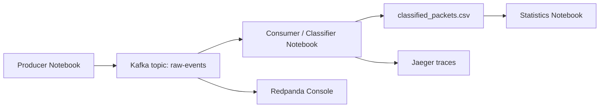

# Lab 3 - Event-Driven Cybersecurity Pipeline with Kafka and Tracing

## 1. Group Members

- `Pavel Fadeev`

> Replace the name above with the full legal name(s) of the group member(s) before final submission if needed.

## 2. Link to the Source Lab Materials

- Lab description: [README.md](README.md)
- Main notebooks:
  [1. Producer.ipynb](notebooks/1.%20Mittre%20classification/1.%20Producer.ipynb),
  [2. Consumer_Classifier.ipynb](notebooks/1.%20Mittre%20classification/2.%20Consumer_Classifier.ipynb),
  [3. Statistics.ipynb](notebooks/1.%20Mittre%20classification/3.%20Statistics.ipynb)

## 3. Short Lab Summary

This lab builds a simplified event-driven cybersecurity pipeline that processes synthetic security events asynchronously. A producer generates events and writes them to Kafka, a consumer classifies them into MITRE ATT&CK tactics and techniques, and the results are saved into a CSV file for later analysis. Jaeger is used to trace the execution path of each event through the pipeline, while Redpanda Console is used to inspect the messages flowing through Kafka.

The goal of the lab is to understand pipeline architecture and observability rather than model accuracy.

## 4. Pipeline Diagram / Sequence

The following sequence reflects the architecture implemented in the lab.

Short step sequence:

1. Start Kafka, Jaeger, Redpanda Console, and JupyterLab with `docker compose`.
2. Run the producer notebook to generate synthetic events and publish them into `raw-events`.
3. Run the consumer notebook to read the messages, classify them, and write the output to CSV.
4. Open Jaeger to inspect the spans created for each processing stage.
5. Open Redpanda Console to inspect the topic messages.
6. Run the statistics notebook to summarize the processed data.

## 5. MITRE ATT&CK Mapping

The consumer uses a simple rule-based mapping from event patterns to ATT&CK labels.

| Tactic | Technique | Triggering event pattern | ATT&CK entry |
|---|---|---|---|
| Execution | Command and Scripting Interpreter: PowerShell | `process_start` event with `EncodedCommand` in the command line | [T1059.001](https://attack.mitre.org/techniques/T1059/001/) |
| Execution | Command and Scripting Interpreter: Windows Command Shell | `process_start` event with `cmd.exe` in the command line | [T1059.003](https://attack.mitre.org/techniques/T1059/003/) |
| Execution | Command and Scripting Interpreter | Other `process_start` events | [T1059](https://attack.mitre.org/techniques/T1059/) |
| Credential Access | Brute Force | `user_login` event with failed login result | [T1110](https://attack.mitre.org/techniques/T1110/) |
| Initial Access | Valid Accounts | `user_login` event with successful login result | [T1078](https://attack.mitre.org/techniques/T1078/) |

## 6. Results from the Current Output

The current file `notebooks/1. Mittre classification/classified_packets.csv` contains `2169` processed events.

Time range:

- first event: `2026-01-15T07:00:24.332367+00:00`
- last event: `2026-01-15T20:24:14.994769+00:00`

Event type distribution:

- `user_login`: `1088`
- `process_start`: `1081`

MITRE tactic distribution:

- `TA0002`: `1081`
- `TA0006`: `563`
- `TA0001`: `525`

MITRE technique distribution:

- `T1110`: `563`
- `T1078`: `525`
- `T1059.001`: `383`
- `T1059`: `375`
- `T1059.003`: `323`

Additional observations:

- host distribution is close to uniform: `win-02` `733`, `win-03` `719`, `win-01` `717`
- user distribution is also close to uniform: `admin` `557`, `alice` `551`, `charlie` `543`, `bob` `518`
- the busiest minute bucket contains `24` events

## 7. Conceptual Questions

### Why is Kafka used instead of direct function calls?

Kafka decouples producers from consumers. The producer only sends events to a topic and does not need to know which component will process them or when. This improves reliability, scalability, and flexibility.

### What happens if the consumer is slower than the producer?

Events accumulate in Kafka and form a backlog. The pipeline keeps working because the queue buffers the difference in speed, and the consumer can later catch up or be scaled horizontally.

### How does tracing help debug pipeline behavior?

Tracing shows the exact order and latency of each stage for one event. In Jaeger it becomes possible to see whether the slowdown happened during production, Kafka consumption, classification, or CSV writing.

### Which pipeline stages could be scaled independently?

The producer and consumer can be scaled independently. The consumer especially can be parallelized using consumer groups. The statistics stage is also independent because it reads stored output rather than the live stream.

### How would this pipeline change in a real SOC system?

In a real SOC, CSV storage would usually be replaced by durable analytical storage such as Elasticsearch, ClickHouse, or a SIEM backend. The simple rule-based classifier would be extended with correlation logic, detection rules, threat intelligence enrichment, and machine learning models.

## 8. Insights / What I Learned

This lab shows that in cybersecurity pipelines, architecture often matters more than the complexity of the model. Kafka provides asynchronous decoupling, Jaeger provides observability, and the MITRE mapping step transforms low-level telemetry into security-relevant labels. The exercise also makes it clear why queues and tracing are essential once a system grows beyond direct function calls and single-process scripts.
