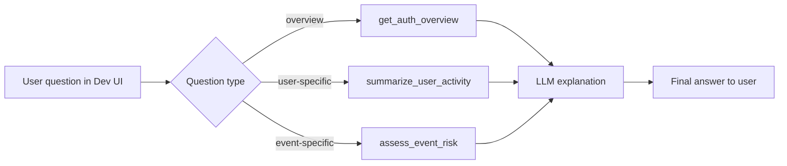

# Lab 4 - Introduction to LLM Agents and Tool Usage

## 1. Group Members

- `Pavel Fadeev`

> Replace the name above with the full legal name(s) of the group member(s) before final submission if needed.

## 2. Source Lab Materials

- Assignment description: [README.md](README.md)
- Implemented agent: [app/auth_log_explainer](app/auth_log_explainer/)
- Agent documentation: [app/auth_log_explainer/README.md](app/auth_log_explainer/README.md)

## 3. Short Lab Summary

This lab introduces the basic mechanics of LLM agents: a system prompt defines
the role of the agent, and Python tools provide structured information that the
agent can call during a conversation. For this submission, I implemented a
simple agent that explains authentication log events and highlights suspicious
patterns in a small in-memory dataset.

The goal of the solution is not to build a full SOC product. The goal is to
show that the agent can use tools correctly, reason over their outputs, and
return short technical explanations to the user.

## 4. Implemented Agent

The implemented agent is **Authentication Log Explainer Agent**. It works with
a small sample dataset of login events and is designed to answer three kinds of
questions:

1. What events and users are available in the dataset?
2. What does one user's login activity look like?
3. Does one selected event look routine or suspicious?

The agent uses structured tool outputs instead of raw free-form prompting. This
demonstrates the expected separation of responsibilities:

- tools retrieve and prepare data,
- the agent interprets the data and explains it in natural language.

## 5. Tools Used

The agent uses three tools:

- `get_auth_overview()` returns the overall dataset summary, available users,
  and suspicious event list.
- `summarize_user_activity(username)` returns one user's success/failure counts,
  countries, protocols, and suspicious events.
- `assess_event_risk(event_id)` returns a structured risk assessment for a
  single event, including severity, reasons, and ATT&CK hypothesis if relevant.

## 6. Agent Workflow

Short step sequence:

1. The user asks the agent a question in Dev UI.
2. The agent chooses the appropriate Python tool.
3. The tool returns structured data about the sample authentication logs.
4. The agent explains the result in short technical English.

## 7. Example Interaction

Example dialogue:

**User:** What suspicious events are present?

**Agent:** The strongest suspicious pattern is around `evt-1004` and
`evt-1005`. Both are failed SSH logins for `bob` from `RU` with many failed
attempts, off-hours activity, and a new device. This looks like a plausible
**T1110 - Brute Force** pattern.

**User:** Assess `evt-1006`.

**Agent:** `evt-1006` is a successful VPN login for `admin`, but it is unusual
because it came from `CN`, occurred off-hours, used a new device, and followed
multiple recent failures. I would mark it as **high severity** and a possible
**T1078 - Valid Accounts** scenario.

## 8. Insights / What I Learned

This lab makes the difference between a normal chatbot and an agent more
concrete. A chatbot only replies with generated text, while an agent can call
tools to retrieve structured information first and then explain the result.
Even with a very small dataset, this pattern is useful because it keeps the
reasoning step separate from the data access step.
